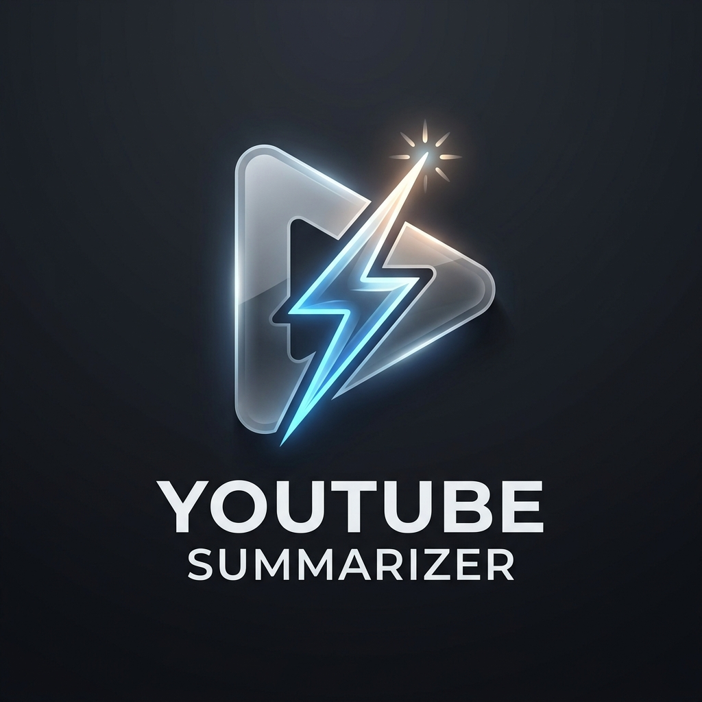
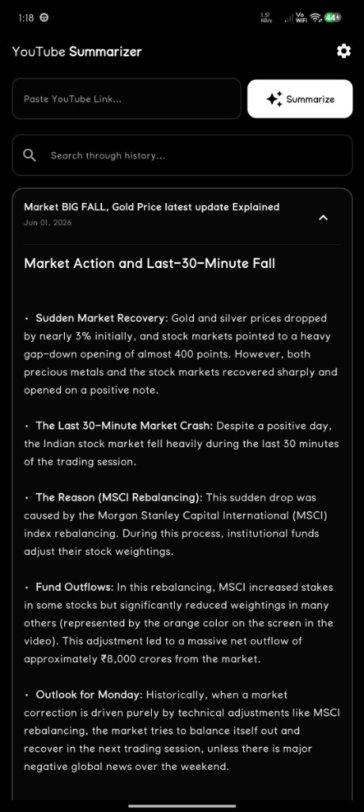
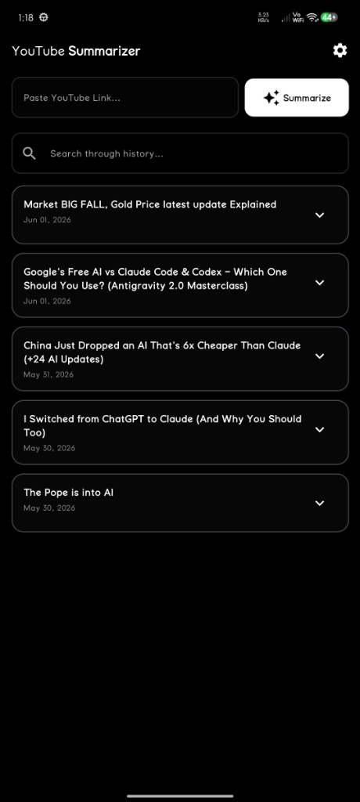

# YouTube Summarizer - Portfolio-Grade Android App

[](https://developer.android.com/)
[](https://kotlinlang.org/)
[](https://developer.android.com/jetpack/compose)
[](https://aistudio.google.com/)
[](LICENSE)

YouTube Summarizer is a frictionless, native Android utility that replicates your desktop AI summarization workflow (like Brave Leo) directly in your mobile usage flow. 

When browsing YouTube or YouTube Vanced, simply tap **Share** -> select **YouTube Summarizer**, and a premium glassmorphic bottom overlay slides up to instantly present a structured, concise bullet-point summary of the video. It runs **100% serverless, completely for free**, and is optimized to run smoothly on mid-range devices like the **Xiaomi 11i**.

---

## 📸 Screenshots & Showcase

<p align="center">
  
</p>

<p align="center">
  
  
</p>

---

## 🎨 Product & Visual UX Design

The user interface moves away from boilerplate generic templates to deliver a modern, minimal startup aesthetic (inspired by linear/arc designs):

*   **Immersion & Depth**: A translucent frosted glass bottom sheet slides up smoothly over your screen, keeping you contextually embedded in your YouTube browsing flow.
*   **Visual Warmth**: Formulated using a gentle Deep Slate background (`#0B0F19`) paired with subtle modern Indigo (`#6366F1`) and Teal (`#0D9488`) accent highlights to avoid night-reading eye fatigue.
*   **Tactile Animation**: Micro-interactions including floating pulse shimmers, sliding state expansions, and instant haptic feedbacks upon clipboard copying.
*   **Responsive Fluidity**: Immediate asynchronous overlay sliding, decoupling heavy disk reads and network loads from the UI canvas.

---

## 🏗️ Architecture Blueprint

To demonstrate senior-level software engineering standards for portfolio evaluation, the project strictly adheres to **Uncle Bob's Clean Architecture** combined with **MVVM (Model-View-ViewModel)** and a **Unidirectional Data Flow (UDF)**.

```
com.summarizer.app/
│
├── core/                         # Shared utilities, extensions, and themes
│   ├── designsystem/            # Theme, ColorTokens, Typography (Material 3)
│   ├── di/                      # Thread-Safe Service Locator (Zero-Overhead DI)
│   └── utils/                   # Youtube Link Parsers & Text Helpers
│
├── data/                         # Infrastructure & Data implementations
│   ├── database/                # Room DB configuration, entities, and DAOs
│   ├── network/                 # Retrofit, Gemini API service, & client scraper
│   ├── preferences/             # EncryptedSharedPreferences (Hardware AES Vault)
│   └── repository/              # Repository coordinates
│
├── domain/                       # Core Business Logic (Framework-independent)
│   ├── model/                   # Domain Entities (Pure Kotlin objects)
│   ├── repository/              # Domain Repository Interfaces
│   └── usecase/                 # Single-purpose UseCases (e.g., GetSummaryUseCase)
│
└── presentation/                 # Presentation Layer (Jetpack Compose & ViewModels)
    ├── history/                 # Dashboard to view/search saved summaries (Option A fallback)
    ├── overlay/                 # Bottom Overlay Share Receiver (Option B)
    └── settings/                # Security Credentials & prompt configuration
```

### Key Technical Achievements:
1.  **Zero-Overhead Dependency Injection**: Implements a thread-safe, double-locked **Service Locator pattern** rather than bloated compilation-based DI libraries. This prevents configuration issues in Android Studio and guarantees **instant Gradle compile speeds**.
2.  **Privacy-First Cryptography**: Implements `EncryptedSharedPreferences` backed by a 256-bit AES Master Key stored directly in your phone's hardware **Android Keystore**, ensuring your Gemini API key is secure and never committed to GitHub.
3.  **On-device Transcript Extraction**: mimics browser headers to extract YouTube subtitle tracks directly, appending `&fmt=json3` to retrieve timed caption nodes in clean JSON, bypassing heavy standard YouTube API quotas completely for free.
4.  **Double-Cache Optimizations**: The `GetSummaryUseCase` queries the local SQLite Room database before initializing scrapers, saving network bandwidth and LLM tokens.

---

## ⚙️ How It Works (Sequence)

```
[YouTube / Vanced App] 
     │
     ├─► User taps Share ──► Selects "YouTube Summarizer"
     │
[OverlayActivity]
     │
     ├─► Intercepts Intent plain-text payload
     ├─► Parses Video ID via YoutubeParser
     │
[OverlayViewModel]
     │
     ├─► Checks local Room DB Cache (Hit? Return instantly!)
     ├─► Scrapes YouTube HTML page for caption links
     ├─► Requests captions in JSON3 structure (fmt=json3)
     ├─► Fetches Gemini API Key from Encrypted Keystore
     ├─► Calls Gemini 1.5 Flash API with prompt template + transcript
     ├─► Caches completed summary in Room DB
     │
[OverlayScreen]
     │
     └─► Slides up frosted bottom sheet showing structured summary Markdown!
```

---

## 🚀 Step-by-Step Local Deployment

Since you are completely new to mobile development, here is the ultimate beginner-friendly guide to compile and run this app on your computer and install it directly onto your **Xiaomi 11i** phone!

### Step 1: Obtain Your Free API Key (30 Seconds)
1. Go to [Google AI Studio](https://aistudio.google.com/).
2. Log in with your standard Google Account.
3. Tap **Get API Key** and copy your private key (`AIzaSy...`). Keep it safe!

### Step 2: Install Android Studio
1. Download and install [Android Studio](https://developer.android.com/studio) (choose the standard recommended setup settings).
2. Launch Android Studio. On the welcome screen, tap **Open** and select this directory (`Youtube Summarise`).
3. Android Studio will automatically download the Android SDK, Gradle build tools, and set up the workspace for you. (This can take 3-5 minutes on the first launch).

### Step 3: Prepare Your Android Phone
To run the app directly on your phone via USB:
1. Open your phone's **Settings** -> **About Phone**.
2. Tap **OS Version** rapidly **7 times** until a message displays: *"You are now a developer!"*
3. Go back to main **Settings** -> **Additional Settings** -> **Developer Options**.
4. Turn ON:
    *   **USB Debugging**
    *   **Install via USB** (Xiaomi hyper-battery security setting)
5. Connect your phone to your computer using a USB cable. If prompted on your phone, choose *"Transfer Files"* and tap *"Always allow USB debugging from this computer"*.

### Step 4: Run the Application!
1. Look at the top bar in Android Studio. You should see a dropdown displaying your device name (e.g., `Xiaomi 11i`).
2. Click the green **Run (Play)** button in the top-right toolbar.
3. Android Studio will compile the app and install the APK directly on your phone.
4. Open the app on your phone, navigate to settings (the top-right cog icon), and paste your Gemini API Key. Tap **Save configurations**.
5. You are done! Go to YouTube or YouTube Vanced, tap **Share**, choose **YouTube Summarizer**, and watch the magic happen!

---

## 🧪 Verification & Testing

Verify parser stability by running standard JVM Unit Tests:
```bash
./gradlew test
```
The test suite maps desktop links, short links, Shorts links, and mobile share headers to ensure the extraction engine is robust.

---

## 📄 License
This project is licensed under the MIT License - see the [LICENSE](LICENSE) file for details.
